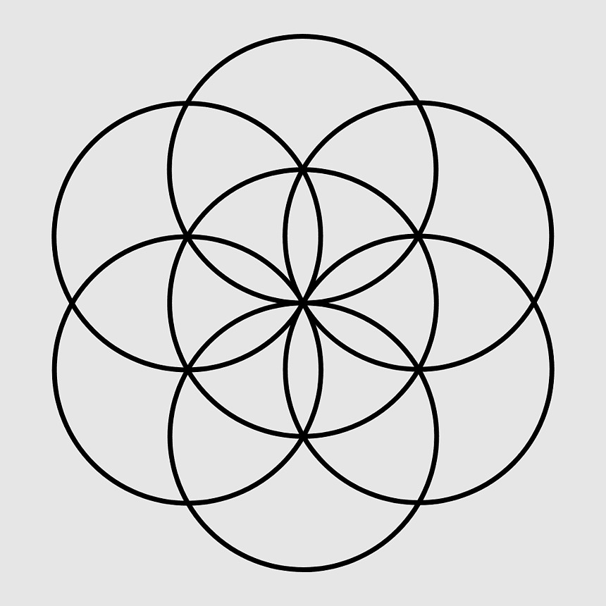
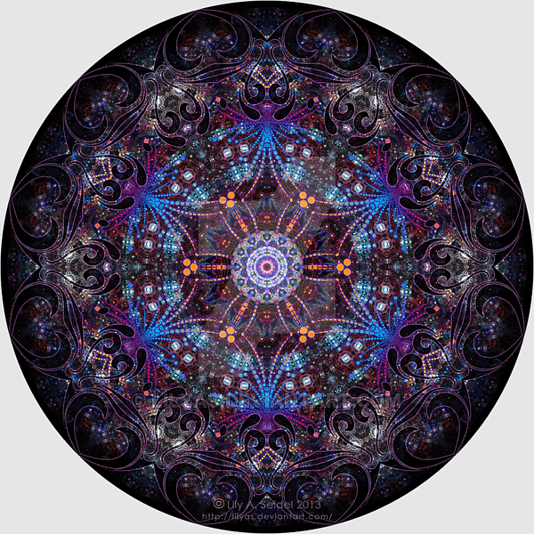
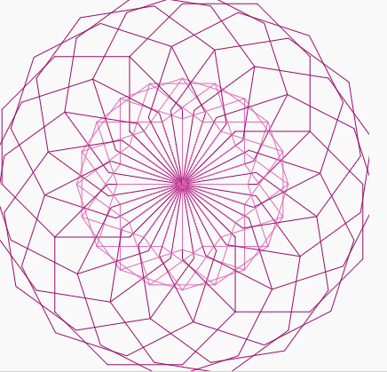

# yuli5135_week8quiz
## part 1

- circle overlapping art

Overlapping art can rotate different shapes around a center many times to create multi-point symmetry, as is the case with the large number of repeating points in Pacita Abad's 'Wheels of fortune'. The idea that the circle is evenly divided into many parts, each of which has the same content, is very helpful for design.

picture

## part 2

code link
https://www.101computing.net/moroccan-mosaic/

picture

The core of this code is to rotate a hexagon around a point and rotate 360 degrees to form a new shape. Many points inside the circle in Pacita Abad 'Wheels of fortune' can be created based on this artistic inspiration. Different points are rotated according to the center of the circle, so as to obtain a large number of symmetrical points. The inside of the circle is filled with multiple rectangles, so the same effect can be obtained by replacing the point with a rectangle for rotation.
